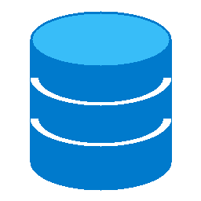

<p align="center">
  
</p>


# CodeDB

Un clone web di DBeaver **multi-database**: esplora database e collection/tabelle,
visualizza i documenti/righe come una tabella, esegui query, modifica i dati.
Supporta **MongoDB** e **MySQL** tramite uno **Strategy Pattern**.
Tutta la comunicazione tra browser e backend avviene tramite **Socket.IO**.


## Stack

- **Backend:** Node.js, Express, Socket.IO
  - MongoDB: driver nativo `mongodb` + `bson` (EJSON)
  - MySQL: `mysql2` (pool)
  - Tunnel SSH opzionale via `ssh2`
- **Frontend:** HTML/CSS/JS vanilla (nessun framework, nessuna build)

## Avvio

```bash
npm install
npm start          # oppure: npm run dev (riavvio automatico)
```

Apri <http://localhost:3030> (porta configurabile con la variabile `PORT`):
comparirà la schermata di connessione. Nel form scegli il **tipo di database**
(MongoDB o MySQL) e inserisci host/porta/credenziali, oppure una connection string
completa (MongoDB).

### Avvio "desktop" e PWA

Il launcher apre solo il browser (o l'App PWA) se il server è già attivo; altrimenti avvia il
server **in background**: la console si chiude subito dopo l'avvio,
i log finiscono in `codedb.log`. Il browser si apre appena la porta risponde e la
**Master Password** per sbloccare i segreti cifrati viene richiesta direttamente nell'interfaccia UI.
Per fermare il server: `CodeDB.cmd stop` / `./codedb.sh stop`.
Se avvii una seconda istanza sulla stessa porta, il server esce con un
messaggio chiaro (usa `PORT=<altra porta>`).


- **Windows** — doppio click su **`CodeDB.cmd`**; con `npm run shortcut` crei i
  collegamenti **CodeDB** (icona `public/codedb.ico`) sul Desktop e nel menu
  Start. I collegamenti puntano a `cmd.exe /c ...` proprio per poter essere
  aggiunti alla **barra delle applicazioni**: tasto destro sul collegamento →
  *Aggiungi alla barra delle applicazioni* (su Windows 11 sotto *Mostra altre
  opzioni*), oppure trascinalo sulla barra; dal menu Start anche *Aggiungi a Start*.
- **Linux/macOS** — `./codedb.sh`; con `npm run shortcut-unix` su Linux crei la
  voce **CodeDB** nel menu applicazioni (`~/.local/share/applications`, icona
  `public/codedb.png`), da cui aggiungerla ai preferiti/dock (GNOME: tasto
  destro → *Aggiungi ai preferiti*); su macOS lo script stampa le istruzioni
  per il Dock o per creare una app con Automator.

Le icone sono generate proceduralmente da `node tools/genera-icona.js`.

### Test end-to-end

Richiedono **il server già avviato su :3030** e un DB locale in ascolto.
Creano e poi ripuliscono i database `gui_mongodb_e2e` / `gui_mysql_e2e`.

```bash
node test/e2e.js           # MongoDB su localhost:27017
node test/e2e-mysql.js     # MySQL locale (root, password vuota; porta env MYSQL_PORT, default 3306)
node test/e2e-mcp.js       # gateway MCP su MongoDB
node test/e2e-mcp-mysql.js # gateway MCP su MySQL (env MYSQL_PORT/MYSQL_PASSWORD)
node test/e2e-backup.js       # CLI di backup su MongoDB (non richiede il server)
node test/e2e-backup-mysql.js # CLI di backup su MySQL (env MYSQL_PORT/MYSQL_PASSWORD; non richiede il server)
```

### Backup e ripristino

CLI dedicata (non serve il server avviato), stessa per MongoDB e MySQL; riusa le
connessioni salvate in `connections.ini` (in sola lettura) e il tunnel SSH:

```bash
npm run backup -- backup  --conn mongo-locale --db shop --type full
npm run backup -- backup  --conn mongo-locale --db shop --type incremental --since-field updatedAt
npm run backup -- restore --conn mongo-locale --from backups/mongo-locale_shop/<id> --target-db shop_copia
npm run backup -- list
npm run backup -- verify  --from backups/mongo-locale_shop/<id>
npm run backup -- help    # guida completa
```

- **Tipi**: `full`, `incremental` (modifiche dall'ultimo backup), `differential`
  (modifiche dall'ultimo full); al restore la catena viene applicata da sola.
  Le cancellazioni non vengono catturate dai backup incrementali/differenziali.
- **Formato**: una cartella per backup con `manifest.json` (checksum SHA-256),
  dati NDJSON Extended JSON compressi gzip (`--no-compress` per disattivare),
  indici (Mongo) e `CREATE TABLE` (MySQL); dump ed elaborazione in streaming,
  adatti a database grandi.
- **Storage cloud** opzionale: `--storage s3://bucket/prefisso` (o `gs://`,
  `azure://`); gli SDK dei provider vanno installati a parte e le credenziali
  arrivano dai canali standard (env/config del provider).
- **Log e notifiche**: attività in `backups/backup.log`; notifica Slack di fine
  operazione con `--slack-webhook <url>` o env `SLACK_WEBHOOK_URL`.
- **Restore selettivo**: `--collections a,b` limita il ripristino; `--drop`
  ricrea da zero le collection/tabelle di destinazione.
- Gli stessi backup sono disponibili via **MCP** con i tool `backup_database`,
  `list_backups` e `restore_backup` (il restore richiede `readOnly=false` e
  doppia conferma umana).

## Funzionalità

| Funzione | Come |
| --- | --- |
| Multi-database | MongoDB e MySQL, selezionabili nel form di connessione |
| Tab di connessione | più connessioni aperte insieme (stile VS Code), una sessione DB per tab |
| Tab di collection | ogni collection/tabella aperta in un proprio coll-tab con snapshot di query e vista |
| Connessioni salvate | sidebar sinistra raggruppata per cartella (`folder`); menu contestuale per aprire/testare/modificare/eliminare |
| Import/export connessioni | scambio del file `.ini` completo (password incluse) |
| Tunnel SSH | connessione via SSH (password o chiave privata + passphrase), solo in modalità "Parametri" |
| Albero database → collection/tabelle | sidebar, con conteggio documenti/righe |
| Vista tabellare | colonne = unione delle chiavi (Mongo) o colonne della tabella (MySQL) |
| Query `find` / WHERE | filtro e sort nella toolbar (JSON/EJSON per Mongo, clausola WHERE + `ORDER BY` per MySQL) |
| Query `aggregate` / SQL Raw | pipeline di aggregazione (Mongo) o SQL libero (MySQL) |
| ⚡ Query & Aggregate Engine | layout a 3 sezioni (Schema Browser, Editor, Risultati), supporto SQL/MQL, doppia vista (Tabella/JSON Tree) e Virtual JOINs |
| 🔀 Virtual JOINs Cross-DB | unione dati in memoria tra tabelle MySQL e collezioni MongoDB in un'unica query logica |
| 📚 Snippet Library | template pronti all'uso (JOIN, GROUP BY, $lookup, $unwind) ed export risultati CSV/JSON/SQL |
| Piano di esecuzione | `explain` (Mongo) / `EXPLAIN` (MySQL) sulla query corrente |
| Cronologia query | query eseguite, ripetibili con un click (persistita per collection) |
| Ordinamento / Paginazione | click sull'intestazione; barra in basso (25/50/100/200 per pagina) |
| Modifica di un campo | doppio click sulla cella |
| Modifica della riga intera | pulsante ✎ sulla riga (editor JSON) |
| Inserimento documento/riga | pulsante "+ Documento" |
| Eliminazione | ✕ sulla riga, oppure **bulk delete** su selezione multipla |
| Selezione celle | selezione stile Excel, copia multi-formato (TSV/JSON/CSV/Markdown/SQL), incolla, export CSV |
| Export/Import collection | export EJSON/CSV/SQL INSERT; import batch con barra di progresso e report errori |
| Export/Import database interi | tasto destro sul database: export in un file `.codedb.json` auto-contenuto (dati EJSON + CREATE TABLE MySQL + indici Mongo) e import con db di destinazione, drop&ricrea opzionale, progresso e report |
| Gestione database/collection | tasto destro nella sidebar: crea, rinomina, elimina |
| Gestione colonne (MySQL) | aggiungi/modifica/elimina colonna (DDL) |
| Dettagli collection | tab "Dettagli": statistiche, indici, schema/colonne |
| Diagramma UML | tab "UML": collection corrente e associazioni con le altre |
| Aggiornamenti live | change stream MongoDB (badge "● LIVE"); auto-refresh dello schema in sidebar |
| Layout responsive | drawer laterale ≤900px, supporto touch/orientamento |
| Gateway MCP per agenti AI | endpoint `/mcp` (Streamable HTTP): esplorazione e query in sola lettura; scritture, drop e cambio del flag `readOnly` solo con doppia conferma umana — vedi `docs/MCP.md` |
| Backup e ripristino | CLI `npm run backup` (full/incrementale/differenziale, gzip + SHA-256, cloud S3/GCS/Azure, log e notifiche Slack, restore selettivo) e tool MCP `backup_database`/`list_backups`/`restore_backup` |

### Note

- L'app è **multi-database**: MongoDB usa EJSON e ObjectId; MySQL espone un `_id`
  virtuale che rappresenta la chiave primaria (`{ colonna: valore }`), con fallback
  all'intera riga se la tabella non ha PK. Per MySQL il `filter` è una clausola
  WHERE libera, il `sort` è SQL o JSON, e la modalità "SQL Raw" esegue query libere.
- Ogni **tab** ha la propria sessione server (strategia dedicata + eventuale tunnel
  SSH, quindi un client/pool per tab, max 8 per socket); alla disconnessione del
  socket vengono chiuse tutte le sessioni.
- Gli **aggiornamenti in tempo reale** (MongoDB) usano i change stream, disponibili
  solo su replica set / Atlas. Su standalone l'app funziona senza badge LIVE (usa ⟳).
  MySQL non ha watch.
- Nei filtri MongoDB puoi usare Extended JSON, es. `{ "_id": { "$oid": "..." } }`;
  le stringhe di 24 caratteri esadecimali in `_id` vengono convertite in ObjectId
  automaticamente. Per le date usa `{ "$date": "2026-01-01T00:00:00Z" }`.
- Le **connessioni salvate** vivono in `connections.ini` nella root (file in
  `.gitignore`): **password e segreti SSH sono in chiaro**, sia nel file sia
  nell'export. Nessun segreto viene mai rimandato al browser: nel form, lasciando
  vuoto il campo, resta quello già salvato. A ogni riscrittura il server conserva
  le due versioni precedenti in `connections.ini.bak` e `.bak2` (stessa cartella):
  se i segreti si corrompono (es. avvio con passphrase sbagliata), recuperale da lì.
- La **rinomina di un database MongoDB** non è nativa: l'app copia le collection
  nel nuovo database (`$out` cross-database, richiede MongoDB ≥ 4.4) e poi elimina
  l'originale.
- Le **associazioni del diagramma UML** sono euristiche (nomi dei campi, tipi
  ObjectId); per MySQL si aggiungono le foreign key reali da `information_schema`.

## Documentazione

- `docs/MCP.md` — guida all'installazione e all'uso del server MCP (Claude Code, Claude Desktop, Cursor...).
- `CLAUDE.md` / `AGENT.md` — guida all'architettura per gli agenti di coding.
- `strategy_db.md` — piano storico di estensione multi-database (MongoDB & MySQL).
- `strategy_mcp.md` — piano e stato dell'integrazione MCP (Fasi 1–3 + estensioni).

## Licenza

Copyright (c) 2026 Federico Ferrulli.

Questo progetto è distribuito sotto licenza **GNU AGPL v3 (GNU Affero General Public License)**, ideale per il modello a doppia licenza (Open Source per uso cooperativo / Licenza Commerciale privata). Vedi il file [LICENSE.md](LICENSE.md) per il testo completo.


</content>
</invoke>
