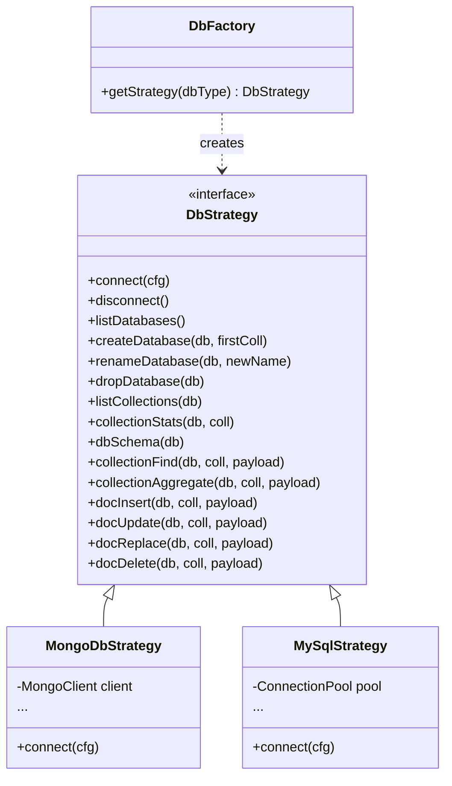

# Strategy DB - Database Extensibility Plan (MongoDB & MySQL)

Questo documento definisce la strategia, l'architettura e il piano di implementazione dettagliato per estendere **Mongo Web GUI** in modo da supportare più tipi di database, introducendo inizialmente il supporto a **MySQL** tramite lo **Strategy Pattern**.

---

## 1. Architettura dello Strategy Pattern

L'obiettivo è separare la logica del server HTTP/Socket.IO da quella specifica del DBMS. Creeremo una cartella `db` contenente le strategie per ciascun database.

### Schema delle Classi/Moduli



---

## 2. Modifiche ai Dati di Connessione (`connections.ini`)

Aggiungeremo il supporto per distinguere il tipo di database salvato.
- Campo `dbType`: valore `mongodb` (default se assente per retrocompatibilità) o `mysql`.
- Campo `database`: utile per MySQL per specificare il database/schema iniziale (opzionale).

Esempio di `connections.ini` aggiornato:
```ini
[ProvaMongoDb]
dbType=mongodb
host=localhost
port=27017
authSource=admin

[ProvaMySQL]
dbType=mysql
host=localhost
port=3306
username=root
password=secret
database=my_app_db
```

---

## 3. Modifiche all'Interfaccia Utente (Frontend)

### A. Modale di Connessione (`public/index.html`)
1. Aggiungere un menu a tendina `<select name="dbType">` all'inizio del form per scegliere tra **MongoDB** e **MySQL**.
2. Aggiungere un campo `<input name="database">` per specificare il database di default (nella sezione parametri).
3. Mostrare/nascondere i parametri in base al database selezionato:
   - Per **MySQL**: nascondere `authSource`. Cambiare la porta di default a `3306`.
   - Per **MongoDB**: mostrare `authSource` e nascondere `database` (o lasciarlo se necessario). Cambiare la porta di default a `27017`.

### B. Vista Dati (`public/js/app.js`)
1. Gestire la visualizzazione e le etichette per MySQL (es. aggiungere un'icona 🐬 per MySQL e 🍃 per MongoDB accanto alle connessioni).
2. Se il database è MySQL, cambiare le etichette e i placeholder:
   - `Filtro` diventa `Clausola WHERE (es. age > 30)`.
   - `Sort` diventa `Ordinamento (es. name ASC) o JSON (es. {"name":1})` per compatibilità.
   - `aggregate` nel menu di modalità diventa `SQL Raw` (permette query SQL libere).

---

## 4. Implementazione dei Dettagli MySQL

### A. Mappatura degli ID
Poiché i database relazionali usano chiavi primarie diverse da `_id` (es. `id`, `user_id`, o chiavi composite), invieremo al client un campo virtuale `_id` che rappresenta la chiave primaria codificata come oggetto JSON.
- Esempio: se la tabella ha come chiave primaria `id = 10`, il client riceverà `_id: { id: 10 }`.
- Quando il client effettuerà un'operazione di UPDATE o DELETE, invierà questo ID. Il backend farà il parse e costruirà la clausola SQL `WHERE id = 10`.
- Se una tabella non ha una chiave primaria, useremo come fallback l'unione di tutte le colonne come chiave composita per permettere comunque la modifica/cancellazione, oppure disabiliteremo le azioni di scrittura.

### B. UML e Schema
Il metodo `dbSchema(db)` interrogherà le tabelle di sistema (`INFORMATION_SCHEMA.KEY_COLUMN_USAGE`) per estrarre le vere chiavi esterne (Foreign Keys) ed evidenziare le relazioni reali tra le tabelle nel diagramma UML! Inoltre, applicheremo le euristiche di denominazione (es. `user_id` -> tabella `users`) per le relazioni non formalizzate.

---

## 5. Dettaglio dei File da Creare e Modificare

### Nuovi File (Pattern Strategies)

1. **`db/DbStrategy.js`**: Classe astratta/Base strategy con l'interfaccia comune per tutte le operazioni sul database.
2. **`db/MongoDbStrategy.js`**: Implementazione della strategia per MongoDB.
3. **`db/MySqlStrategy.js`**: Implementazione della strategia per MySQL usando `mysql2`.
4. **`db/DbFactory.js`**: Factory helper per istanziare ed inizializzare la strategia corretta basandosi sul parametro `dbType`.

### File da Modificare

1. **`package.json`**: Aggiunta della dipendenza `mysql2` per consentire connessioni MySQL.
2. **`server.js`**:
   - Aggiornamento di `CONN_FIELDS` con `dbType` e `database`.
   - Modifica della gestione della connessione per memorizzare l'istanza della strategia del database associata a ciascun socket.
   - Delegamento di tutti gli eventi socket legati al database alla strategia attiva del rispettivo socket.
3. **`public/index.html`**: Aggiunta dei controlli per `dbType` e `database` nella form del modale di connessione.
4. **`public/js/app.js`**:
   - Modifica della form di connessione per gestire visibilità dei parametri e impostazioni predefinite dei campi in base a `dbType`.
   - Modifica dei placeholder in base alla tecnologia DB attiva (MongoDB/MySQL).
   - Popolamento dei campi di modifica connessione.

---

## 6. Piano di Verifica

1. **Test di regressione (MongoDB)**: Eseguire `node test/e2e.js` per garantire la regressione su MongoDB (nessun impatto sulle funzionalità esistenti).
2. **Test manuali (MySQL)**:
   - Creare un database di test MySQL locale.
   - Testare la connessione salvata, la lista delle tabelle, le query find, l'inserimento, la modifica e la cancellazione di righe.
   - Testare la query SQL Raw (modalità aggregate).
   - Verificare che il diagramma UML mostri correttamente le tabelle MySQL e le relazioni.
